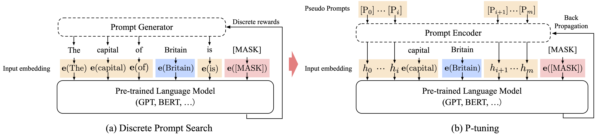

# P-tuning
A novel method to tune language models. Codes and datasets for paper [``GPT understands, too''](https://arxiv.org/abs/2103.10385).

[Xiao Liu*](https://scholar.google.com.hk/citations?user=VKI8EhUAAAAJ&hl=zh-CN), [Yanan Zheng*](zheng-yanan.github.io), [Zhengxiao Du](https://scholar.google.com/citations?user=A8x07E0AAAAJ&hl=en), [Ming Ding](https://scholar.google.com/citations?user=Va50YzkAAAAJ&hl=en), [Yujie Qian](https://scholar.google.com/citations?user=93a-9kkAAAAJ&hl=en), [Zhilin Yang](https://scholar.google.com.hk/citations?user=7qXxyJkAAAAJ&hl=en), [Jie Tang](http://keg.cs.tsinghua.edu.cn/jietang/)

You may be also interested in our another work GLM: [All NLP Tasks Are Generation Tasks: A General Pretraining Framework](https://github.com/THUDM/GLM)

## How to use our code
We have released the code and datasets for LAMA and few-shot SuperGLUE (32-dev) experiments. Please check **README.md** and **requirement.txt** in the corresponding subdirectories for details.

The [LAMA](https://cloud.tsinghua.edu.cn/f/21b9dcf05cc44adfad25/?dl=1) and [FewGLUE_32dev](https://github.com/THUDM/P-tuning/tree/main/FewGLUE_32dev) datasets are available. The LAMA dataset should be placed in ./data directory, and the SuperGLUE dataset should be placed in the ./ (project root) directory.

## Citation

If you find our work useful, please cite the following paper:

    @article{liu2021gpt,
  title={GPT Understands, Too},
  author={Liu, Xiao and Zheng, Yanan and Du, Zhengxiao and Ding, Ming and Qian, Yujie and Yang, Zhilin and Tang, Jie},
  journal={arXiv preprint arXiv:2103.10385},
  year={2021}
}
